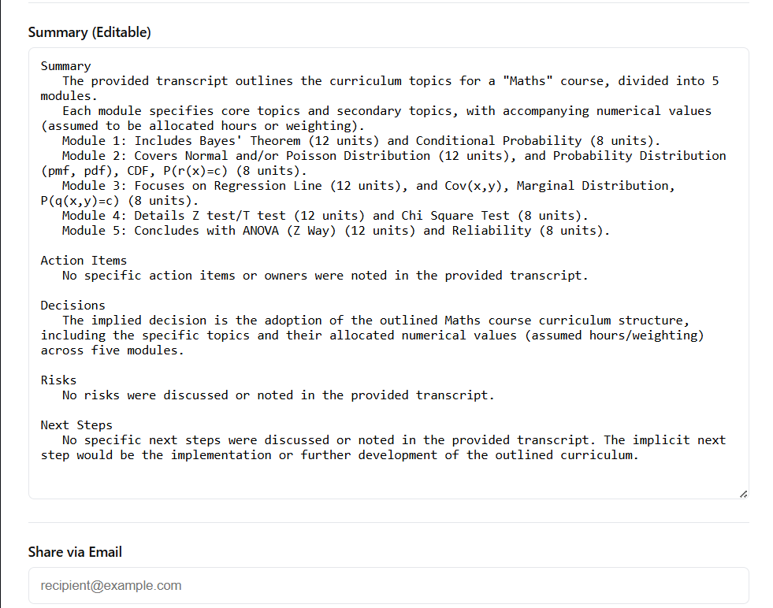
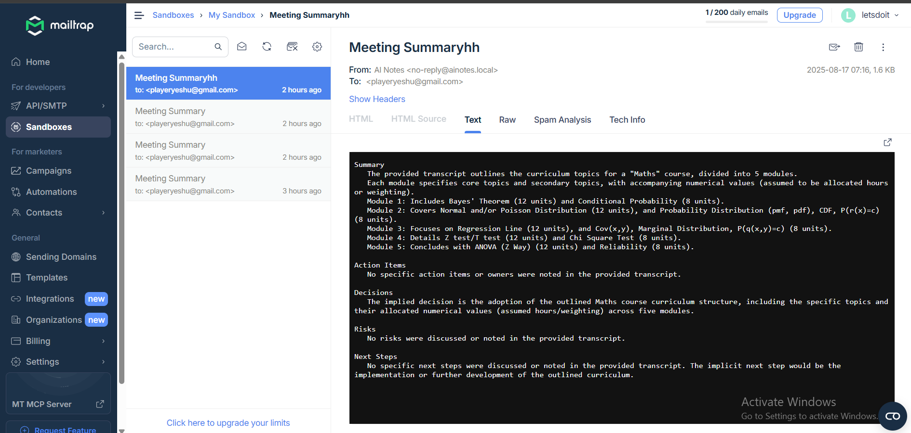

# AI-Powered Meeting Notes Summarizer & Sharer

This project is a full-stack application that automatically generates structured meeting summaries from raw transcripts using AI, and allows users to edit and share via email.

##  Project Aim

The application is an AI-powered meeting notes summarizer and share.

### How it Works

- Upload a text transcript (e.g., meeting notes, call transcript).
- Input a custom instruction/prompt (e.g., "Summarize in bullet points for executives" or "Highlight only action items").
- Click Generate Summary → AI generates a structured summary.
- The summary is editable within the app.
- Users can share the summary via email by entering recipient addresses.

## Features

- Upload meeting transcript
- Generate AI-powered summaries
- Editable summaries in a user-friendly editor
- Email sharing functionality (via Mailtrap)
- Backend with validation, rate limiting, and error handling
- Secure with CORS & Helmet middleware

## Tech Stack

### Backend

- Node.js + Express.js (REST API)
- express-rate-limit → Prevent abuse
- helmet → Security headers
- cors → Cross-origin handling
- dotenv → Config management
- Mailtrap → Test email sending
- LLM API (Gemini) → AI-powered summarization

### Frontend

- React (Vite) → SPA frontend
- CSS → Styling

## 🌐 API Routes

### AI Routes

**POST /api/summarize**

- **Body**: `{ transcript: string, prompt?: string }`
- **Response**: `{ ok: true, summary: string }`

### Email Routes

**POST /api/email**

- **Body**: `{ to: string, subject: string, content: string }`
- **Response**: `{ ok: true, messageId }`

## 📸 Screenshots

- **AI-Generated Summary (Editable UI)**

- **Email Proof via Mailtrap**

## 📜 License
MIT License — feel free to use and adapt.

This app helps teams save time, focus on key decisions, and keep everyone aligned after meetings.
